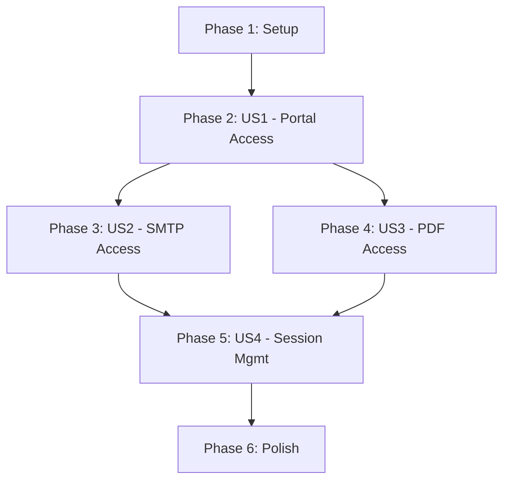

# Implementation Tasks: Unified Login with Portal Access

**Feature**: Unified Login with Portal Access  
**Branch**: `003-unified-login`  
**Created**: 2025-11-30

## Overview

This document breaks down the implementation into executable tasks organized by user story priority. Each phase represents an independently testable increment of functionality.

## Task Summary

- **Total Tasks**: 15
- **User Story 1 (P1)**: 7 tasks - Core login and portal access
- **User Story 2 (P2)**: 2 tasks - SMTP portal integration
- **User Story 3 (P2)**: 2 tasks - PDF portal integration  
- **User Story 4 (P3)**: 2 tasks - Session management enhancements
- **Polish**: 2 tasks - Final refinements

## Phase 1: Setup & Prerequisites

**Goal**: Ensure development environment is ready.

### Tasks

- [ ] T001 Verify NextAuth configuration in src/lib/auth.ts
- [ ] T002 Verify database schema has users table in src/db/schema.ts

## Phase 2: User Story 1 - Single Login Access to Portal (P1)

**Goal**: Implement core login flow with portal dashboard access.

**Independent Test**: Login with valid credentials → redirected to `/portal` → see links to SMTP and PDF features.

### Tasks

- [ ] T003 [US1] Update auth.config.ts to protect /portal, /smtp, and /pdf routes in src/lib/auth.config.ts
- [ ] T004 [P] [US1] Create portal dashboard page at src/app/portal/page.tsx
- [ ] T005 [P] [US1] Create portal layout with navigation in src/app/portal/layout.tsx
- [ ] T006 [US1] Update login page to redirect to /portal on success in src/app/login/page.tsx
- [ ] T007 [US1] Add logout button component in src/components/LogoutButton.tsx
- [ ] T008 [US1] Update middleware matcher to include portal routes in middleware.ts
- [ ] T009 [US1] Test login flow: valid credentials → portal access, invalid → error message

## Phase 3: User Story 2 - SMTP Portal Access (P2)

**Goal**: Ensure SMTP features are accessible from authenticated portal.

**Independent Test**: Login → navigate to SMTP from portal → perform CRUD operations on configs.

### Tasks

- [ ] T010 [US2] Add SMTP navigation link in portal dashboard src/app/portal/page.tsx
- [ ] T011 [US2] Verify SMTP page protection and functionality at src/app/smtp/page.tsx

## Phase 4: User Story 3 - PDF Portal Access (P2)

**Goal**: Ensure PDF features are accessible from authenticated portal.

**Independent Test**: Login → navigate to PDF from portal → perform CRUD operations on configs.

### Tasks

- [ ] T012 [US3] Add PDF navigation link in portal dashboard src/app/portal/page.tsx
- [ ] T013 [US3] Verify PDF page protection and functionality at src/app/pdf/page.tsx

## Phase 5: User Story 4 - Session Management (P3)

**Goal**: Enhance session persistence and logout functionality.

**Independent Test**: Login → navigate between SMTP/PDF → verify no re-auth needed → logout → verify redirect.

### Tasks

- [ ] T014 [US4] Implement logout functionality in LogoutButton component src/components/LogoutButton.tsx
- [ ] T015 [US4] Test session persistence across portal navigation and logout flow

## Phase 6: Polish & Cross-Cutting Concerns

**Goal**: Final refinements and documentation.

### Tasks

- [ ] T016 Update README with new portal access instructions
- [ ] T017 Verify all protected routes redirect unauthenticated users to /login

## Dependencies

**Critical Path**: Setup → US1 → US2/US3 → US4 → Polish

**Parallel Opportunities**:
- T004 and T005 can be done in parallel (different files)
- T010 and T012 can be done in parallel (adding links)
- T011 and T013 can be done in parallel (verification tasks)

## Implementation Strategy

### MVP Scope (Minimum Viable Product)
Complete **Phase 2 (User Story 1)** for a working login → portal flow.

### Incremental Delivery
1. **Week 1**: Complete US1 - Users can login and see portal dashboard
2. **Week 2**: Complete US2 & US3 - Full SMTP and PDF access from portal
3. **Week 3**: Complete US4 & Polish - Session management and final touches

## Testing Checklist

After completing each phase:

### Phase 2 (US1) Testing
- [ ] Login with valid credentials redirects to `/portal`
- [ ] Portal dashboard displays SMTP and PDF options
- [ ] Login with invalid credentials shows error message
- [ ] Direct access to `/smtp` or `/pdf` without auth redirects to `/login`

### Phase 3 (US2) Testing
- [ ] SMTP link navigates to `/smtp` page
- [ ] SMTP CRUD operations work correctly
- [ ] SMTP page is protected (requires auth)

### Phase 4 (US3) Testing
- [ ] PDF link navigates to `/pdf` page
- [ ] PDF CRUD operations work correctly
- [ ] PDF page is protected (requires auth)

### Phase 5 (US4) Testing
- [ ] Session persists when navigating between `/smtp` and `/pdf`
- [ ] Logout button terminates session
- [ ] After logout, accessing protected routes redirects to `/login`

## Notes

- All existing SMTP and PDF functionality must remain intact (FR-011, FR-012, FR-013)
- Use Mantine components for UI consistency
- Follow existing code patterns in `src/app/smtp/page.tsx` and `src/app/pdf/page.tsx`
